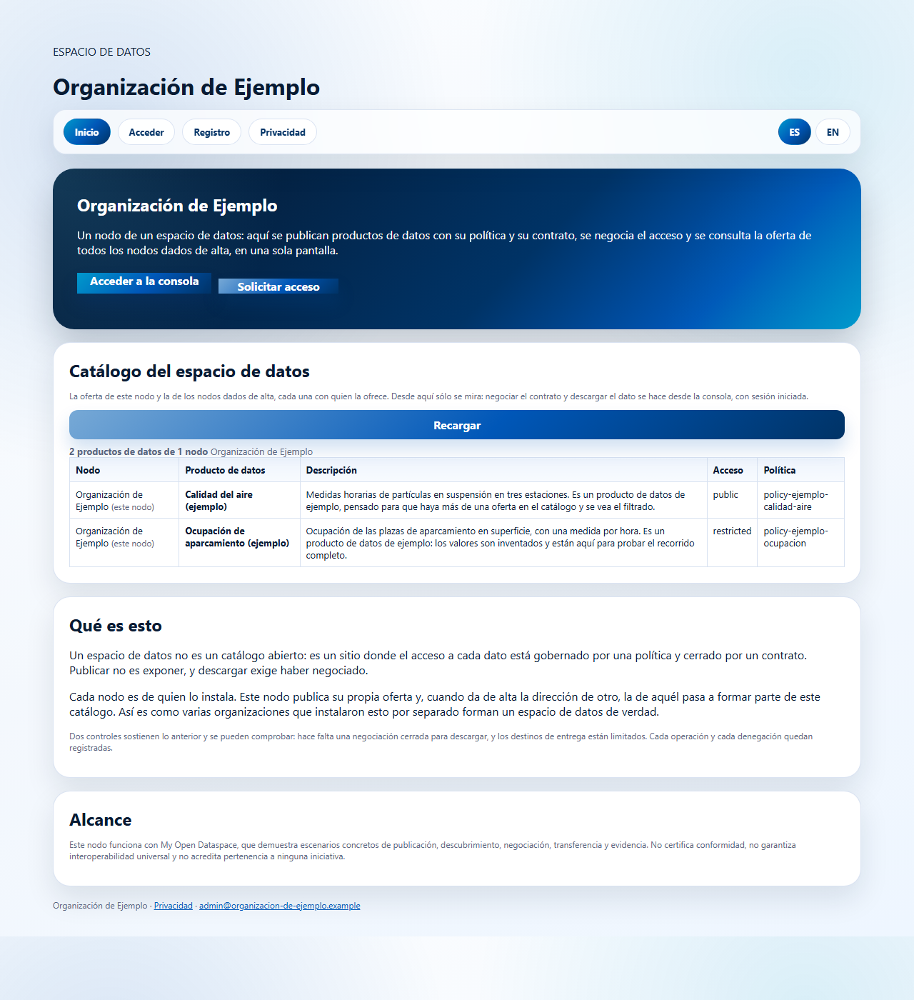

# My Open Dataspace

**Self-hosted EDC dataspace. Install in five minutes, publish data products
with policies, negotiate contracts and federate your catalogue with other
nodes.**

*Espacio de datos EDC autoalojado. Instálalo en cinco minutos, publica
productos de datos con sus políticas, negocia contratos y federa tu catálogo
con otros nodos.*

---

> **Versión 0.1, recién publicada.** Se instala y funciona: el recorrido
> completo pasa en verde contra un nodo levantado de verdad.
>
> **Las imágenes todavía no están publicadas**, así que el `docker run` de
> aquí abajo aún no resuelve: hoy `install.sh` construye en local, y tarda
> unos minutos la primera vez. Se publican al cortar la primera versión.
>
> Qué está hecho y qué no, sin adornos, en [docs/estado.md](docs/estado.md).



## Qué resuelve

Montar un espacio de datos hoy significa elegir un conector, una identidad, un
catálogo, un almacén y una forma de que todo eso se hable — y repetirlo en cada
organización que quiera participar. Este proyecto entrega esa combinación ya
resuelta, en seis contenedores, para que una organización la instale, le ponga
su correo, su marca y sus casos de uso, y empiece a publicar y negociar datos
el mismo día.

Y para que sea un espacio de datos y no un catálogo aislado, cada nodo puede
dar de alta la dirección de otros nodos: sus ofertas se consolidan en una sola
pantalla desde la que se negocia y se descarga igual que con un producto
propio.

## Los tres caminos

### Probarlo — un minuto

```bash
docker run -p 8080:8080 myopendataspace/my-open-dataspace
```

Portal, conector, base de datos y almacén RDF en un contenedor. Para
evaluación y docencia: **sin TLS, sin identidad y sin autenticación**, de modo
que cualquiera que alcance el puerto puede publicar, negociar y descargar. Lo
advierte al arrancar con un cartel que ocupa media pantalla.

No se puede dejar así por descuido: el modo de evaluación se apaga solo si
detecta una identidad o un dominio configurados.

### Instalarlo — cinco minutos

```bash
git clone https://github.com/nekosphera/my-open-dataspace
cd my-open-dataspace
./install.sh
```

El instalador pregunta cuatro cosas —nombre de la organización, correo del
administrador, dominio (opcional) e idioma—, genera las contraseñas de
servicio que falten, levanta la composición y espera a que conteste. Después
abres `/setup` y respondes cuatro preguntas más: ahí eliges tu contraseña de
administrador, que no la genera nadie por ti.

Ejecutarlo dos veces no rompe nada: un `.env` que ya existe no se sobrescribe.

De cero a un producto de datos publicado, con el que probar el recorrido
completo: **menos de un minuto** con las imágenes ya descargadas.

### Operarlo

`docker compose` con tu propio `.env` —que no se versiona: lleva las
contraseñas del nodo—. Actualizar es cambiar `ODS_IMAGE_APP` y
`ODS_IMAGE_CONNECTOR` y volver a levantar.

Copias de seguridad: `./deploy/backup.sh`, y
[docs/backup.md](docs/backup.md) explica qué se salva, qué no hace falta
salvar y cómo comprobar que la copia sirve **antes** de necesitarla.

## Qué lleva dentro

| Contenedor | Para qué |
|---|---|
| `caddy` | Puerta de entrada y TLS automático. Un único puerto expuesto. |
| `app` | Portal público, consola del participante y API de alta. |
| `connector` | Conector EDC: activos, políticas, contratos, negociación y descarga mediada. |
| `postgres` | Base única para la aplicación y el conector. |
| `keycloak` | Identidad OIDC y roles, con el realm importado en el arranque. |
| `fuseki` | Almacén RDF que sostiene el catálogo federado consolidado. |

## Personalizarlo

Es el motivo de que el proyecto exista. Manual completo en
[docs/personalizacion.md](docs/personalizacion.md), incluida la lista de lo
que **no** se puede personalizar sin tocar código, dicha ahí para que nadie lo
descubra a mitad de una migración.

- **Marca** — nombre, logotipo, color y aviso legal desde `.env` y el asistente.
- **Perfiles** — `profiles/` trae `dcat-ap` y `odrl` genéricos. Añadir el tuyo
  es copiar una carpeta; no hay que tocar código.
- **Casos de uso** — `seed/` trae los datos de ejemplo, pensados para
  sustituirlos por los propios.
- **Nodos conocidos** — desde la consola se añade la dirección de otro nodo y
  su oferta pasa a formar parte del catálogo consolidado. Lo único que un nodo
  expone para eso es `GET /api/v1/catalog`: público, de sólo lectura y sólo
  con la oferta. La API de administración del conector no se publica nunca.

## Alcance

El proyecto demuestra escenarios concretos de publicación, descubrimiento,
negociación, transferencia y evidencia. **No certifica conformidad, no
garantiza interoperabilidad universal y no acredita pertenencia a SIMPL,
Gaia-X, FIWARE, IDSA ni EHDS.**

El conector que se entrega es propio, no una distribución oficial de Eclipse
Dataspace Components, y no se ha ejecutado contra la suite de pruebas del
Dataspace Protocol.

El texto completo, y el que se copia en las notas de cada versión, está en
[docs/alcance.md](docs/alcance.md).

## Documentación

| | |
|---|---|
| [Personalizar tu nodo](docs/personalizacion.md) | Marca, perfiles, casos de uso, y qué no se personaliza |
| [Levantar dos nodos](docs/dos-nodos.md) | Ver la federación funcionando, y probar que un nodo caído no rompe la vista |
| [Copias de seguridad](docs/backup.md) | Qué salvar, cómo restaurar y cómo comprobarlo |
| [Publicar una versión](docs/publicar.md) | Cómo se corta, qué imágenes salen y cómo verificarlas |
| [Alcance](docs/alcance.md) | Lo que este proyecto no afirma |
| [Estado](docs/estado.md) | Qué está hecho y qué no |
| [Decisiones](docs/decisiones.md) | Lo que la especificación no cubría, y por qué se resolvió así |
| [Procedencia](docs/procedencia.md) | De qué repositorio y de qué commit sale cada bloque |

## Licencia

[Apache-2.0](LICENSE). Las atribuciones de terceros están en
[NOTICE](NOTICE).
