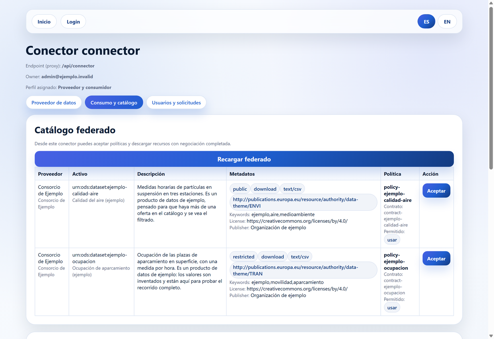

# My Open Dataspace

**Self-hosted EDC dataspace. Install in five minutes, publish data products
with policies, negotiate contracts and federate your catalogue with other
nodes.**

*Espacio de datos EDC autoalojado. Instálalo en cinco minutos, publica
productos de datos con sus políticas, negocia contratos y federa tu catálogo
con otros nodos.*

---

> **Versión publicada: 0.1.0**, con imágenes firmadas para Intel y ARM. El
> recorrido completo pasa en verde contra un nodo levantado de verdad.
>
> `main` va por delante: trae **un conector por participante**, la separación
> entre publicar y administrar el nodo, y una prueba que abre un navegador de
> verdad para el alta, el acceso y la publicación. Sin cortar todavía —
> [CHANGELOG.md](CHANGELOG.md) lo lista.
>
> Qué está hecho y qué no, sin adornos, en [docs/estado.md](docs/estado.md).


## Qué resuelve

Montar un espacio de datos hoy significa elegir un conector, una identidad, un
catálogo, un almacén y una forma de que todo eso se hable — y repetirlo en cada
organización que quiera participar. Este proyecto entrega esa combinación ya
resuelta —seis contenedores, más el conector de cada participante que se dé de
alta— para que una organización la instale, le ponga su correo, su marca y sus
casos de uso, y empiece a publicar y negociar datos el mismo día.

Y para que sea un espacio de datos y no un catálogo aislado, cada nodo puede
dar de alta la dirección de otros nodos: sus ofertas se consolidan en una sola
pantalla desde la que se negocia y se descarga igual que con un producto
propio.

## Los tres caminos

### Probarlo — un minuto

```bash
docker run -p 8080:8080 -v ods-datos:/var/lib/ods   ghcr.io/nekosphera/my-open-dataspace:0.1.0
```

El `-v` importa: sin él, Docker usa un volumen anónimo y **todo lo que
configures desaparece al borrar el contenedor** — vuelves al asistente. La
imagen lo avisa al arrancar, porque desde dentro de un contenedor no hay forma
de saber si su volumen tiene nombre.

Portal, conector, base de datos y almacén RDF en un contenedor. Para
evaluación y docencia: **sin TLS, sin identidad y sin autenticación**, de modo
que cualquiera que alcance el puerto puede publicar, negociar y descargar. Lo
advierte al arrancar con un cartel que ocupa media pantalla.

No se puede dejar así por descuido: el modo de evaluación se apaga solo si
detecta una identidad o un dominio configurados.

### Instalarlo — cinco minutos

```bash
git clone https://github.com/nekosphera/my-open-dataspace
cd my-open-dataspace
./install.sh
```

El instalador pregunta cuatro cosas —nombre de la organización, correo del
administrador, dominio (opcional) e idioma—, genera las contraseñas de
servicio que falten, levanta la composición y espera a que conteste. Después
abres `/setup` y respondes cuatro preguntas más: ahí eliges tu contraseña de
administrador, que no la genera nadie por ti.

Ejecutarlo dos veces no rompe nada: un `.env` que ya existe no se sobrescribe.

De cero a un producto de datos publicado, con el que probar el recorrido
completo: **menos de un minuto** con las imágenes ya descargadas.

### Operarlo

`docker compose` con tu propio `.env` —que no se versiona: lleva las
contraseñas del nodo—. Actualizar es cambiar la etiqueta y volver a levantar:

```bash
ODS_IMAGE_APP="ghcr.io/nekosphera/app:0.1.0"
ODS_IMAGE_CONNECTOR="ghcr.io/nekosphera/connector:0.1.0"
```

Las imágenes van firmadas y con su inventario de componentes; cómo
verificarlas, en [docs/publicar.md](docs/publicar.md).

Copias de seguridad: `./deploy/backup.sh`, y
[docs/backup.md](docs/backup.md) explica qué se salva, qué no hace falta
salvar y cómo comprobar que la copia sirve **antes** de necesitarla.

¿No puedes entrar en tu nodo? `./reiniciar.sh --contrasena <correo>` —en
PowerShell, `.\reiniciar.ps1`—, y si eso no basta,
[docs/recuperar.md](docs/recuperar.md) tiene las otras dos salidas.

**Dónde vive el dato.** El conector sólo va a buscarlo a los dominios de
`ODS_DOWNLOAD_ALLOWED_HOSTS`, que trae `localhost`. Si publicas un producto
cuyo fichero está en otra organización, añade su dominio ahí o nadie podrá
descargarlo. El nodo te lo dice **al publicar**, no cuando alguien intente la
descarga:

```
Este nodo no puede ir a buscar datos a «ejemplo.org», así que publicarlo
dejaría una oferta que nadie puede descargar. Añade «ejemplo.org» a
ODS_DOWNLOAD_ALLOWED_HOSTS en el .env y reinicia el conector.
```

**Qué sale de tu nodo.** El catálogo que otros nodos leen
—`GET /api/v1/catalog`, público y de sólo lectura— lleva la oferta y **el
correo de `ODS_ADMIN_EMAIL`** como contacto del participante, que es lo que
pide DCAT-AP. Ninguna otra dirección sale: a cada oferta se le atribuye el
identificador de su conector, nunca el correo de quien la publicó. Si no
quieres una dirección personal en el catálogo de los demás, pon una de rol.

## Un conector por participante

Cualquiera puede solicitar el alta en un nodo desde su página de registro,
diciendo si quiere operar como **consumidor**, como **proveedor** o como ambos.
Quien administra el nodo lo aprueba desde la consola y, al aprobarlo, se le
despliega su propio conector con ese perfil.

Suyo quiere decir suyo: tiene su identificador, sus credenciales, su oferta y
su consola. Los activos, las políticas y los contratos que publique son de su
conector, no del nodo — en «Ver mis activos» ve lo suyo y nada más —, y en el
catálogo del espacio de datos aparecen atribuidos a él. Otro participante del
mismo nodo ve esa oferta como de un tercero: acepta su política, negocia el
contrato y descarga el dato, igual que si estuviera en otra organización.

Quién puede hacer qué lo decide su perfil, y lo hace cumplir el conector:
publicar exige `dataspace-provider`, negociar `dataspace-negotiator`, y aprobar
altas es de `dataspace-admins` y de nadie más. La identidad del conector viaja
firmada en el token, no se deduce de un nombre.

> **Lo que cuesta, sin adornos.** Levantar un contenedor por participante exige
> el socket de Docker montado en `app`, y **eso es acceso equivalente a root en
> la máquina anfitriona**: quien alcance ese proceso puede pedirle al demonio un
> contenedor privilegiado o el disco del anfitrión montado. El `:ro` del montaje
> sólo impide reescribir el fichero del socket; no limita nada de lo que se hace
> a través de él.
>
> Quien no quiera esa exposición quita esa línea de `docker-compose.yml`. Las
> altas se quedan entonces sin conector propio, y el nodo lo dice al aprobar en
> vez de fallar en silencio.

## La consola

Es donde se trabaja: se publica un producto de datos con su política y su
contrato, se ve la oferta consolidada de todos los nodos dados de alta, se
acepta una política y se descarga el dato. Quien administra el nodo tiene
además la pestaña de altas, para aprobar a quien pide entrar.



Descargar exige una negociación cerrada, y el conector la ata a la persona que
la hizo: un intento sin ella se rechaza y queda registrado.

Cuando alguien crea un contrato, su oferta **tarda unos segundos** en aparecer
en el catálogo federado. El nodo federa al ver nacer el contrato, sin esperar al
intervalo de sincronización, pero tiene que preguntar a cada conector y escribir
la diferencia en el almacén RDF. La consola lo recarga sola: si no aparece a la
primera, no vuelvas a crear el contrato —espera o pulsa **Recargar federado**.

## Qué lleva dentro

| Contenedor | Para qué |
|---|---|
| `caddy` | Puerta de entrada y TLS automático. Un único puerto expuesto. |
| `app` | Portal público, consola del participante y API de alta. |
| `connector` | Conector EDC del nodo: activos, políticas, contratos, negociación y descarga mediada. |
| `postgres` | Base para la aplicación, para el conector del nodo y para el de cada participante. |
| `keycloak` | Identidad OIDC y roles, con el realm importado en el arranque. |
| `fuseki` | Almacén RDF que sostiene el catálogo federado consolidado. |
| `ods-connector-…` | Uno por participante. Lo levanta el nodo al aprobar su alta, con su propia base de datos, y lo retira cuando se le retira a él. |

## Personalizarlo

Es el motivo de que el proyecto exista. Manual completo en
[docs/personalizacion.md](docs/personalizacion.md), incluida la lista de lo
que **no** se puede personalizar sin tocar código, dicha ahí para que nadie lo
descubra a mitad de una migración.

- **Marca** — nombre, logotipo, color y aviso legal desde `.env` y el asistente.
- **Perfiles** — `profiles/` trae `dcat-ap` y `odrl` genéricos. Añadir el tuyo
  es copiar una carpeta; no hay que tocar código.
- **Casos de uso** — `seed/` trae los datos de ejemplo, pensados para
  sustituirlos por los propios.
- **Federación con otros nodos** — la oferta de otro nodo pasa a formar parte
  de tu catálogo consolidado. Lo único que un nodo expone para eso es
  `GET /api/v1/catalog`: público, de sólo lectura y sólo con la oferta. La API
  de administración del conector no se publica nunca. El procedimiento está en
  [docs/dos-nodos.md](docs/dos-nodos.md).

## Alcance

El proyecto demuestra escenarios concretos de publicación, descubrimiento,
negociación, transferencia y evidencia. **No certifica conformidad, no
garantiza interoperabilidad universal y no acredita pertenencia a SIMPL,
Gaia-X, FIWARE, IDSA ni EHDS.**

El conector que se entrega es propio, no una distribución oficial de Eclipse
Dataspace Components, y no se ha ejecutado contra la suite de pruebas del
Dataspace Protocol.

El texto completo, y el que se copia en las notas de cada versión, está en
[docs/alcance.md](docs/alcance.md).

## Documentación

| | |
|---|---|
| [Personalizar tu nodo](docs/personalizacion.md) | Marca, perfiles, casos de uso, y qué no se personaliza |
| [Levantar dos nodos](docs/dos-nodos.md) | Ver la federación funcionando, y probar que un nodo caído no rompe la vista |
| [Copias de seguridad](docs/backup.md) | Qué salvar, cómo restaurar y cómo comprobarlo |
| [No puedo entrar en mi nodo](docs/recuperar.md) | Contraseña, reabrir el asistente, o empezar de cero |
| [Publicar una versión](docs/publicar.md) | Cómo se corta, qué imágenes salen y cómo verificarlas |
| [Alcance](docs/alcance.md) | Lo que este proyecto no afirma |
| [Estado](docs/estado.md) | Qué está hecho y qué no |
| [Decisiones](docs/decisiones.md) | Lo que la especificación no cubría, y por qué se resolvió así |
| [Procedencia](docs/procedencia.md) | De qué repositorio y de qué commit sale cada bloque |
| [Cambios](CHANGELOG.md) | Qué ha cambiado, y por qué |

## Licencia

[Apache-2.0](LICENSE). Las atribuciones de terceros están en
[NOTICE](NOTICE).
